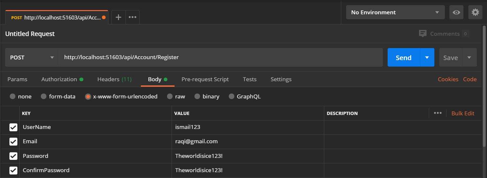
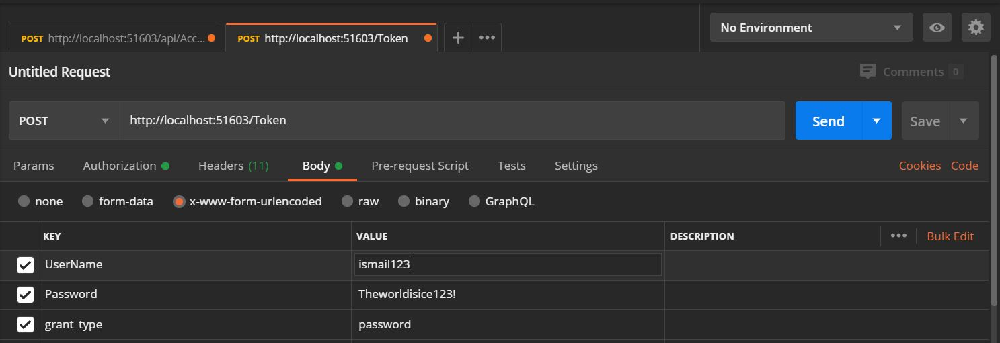
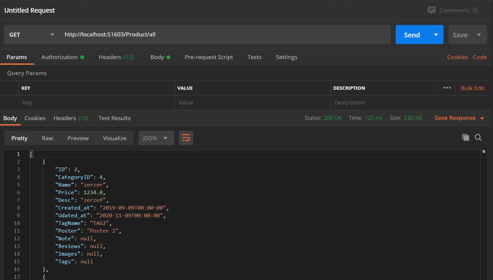
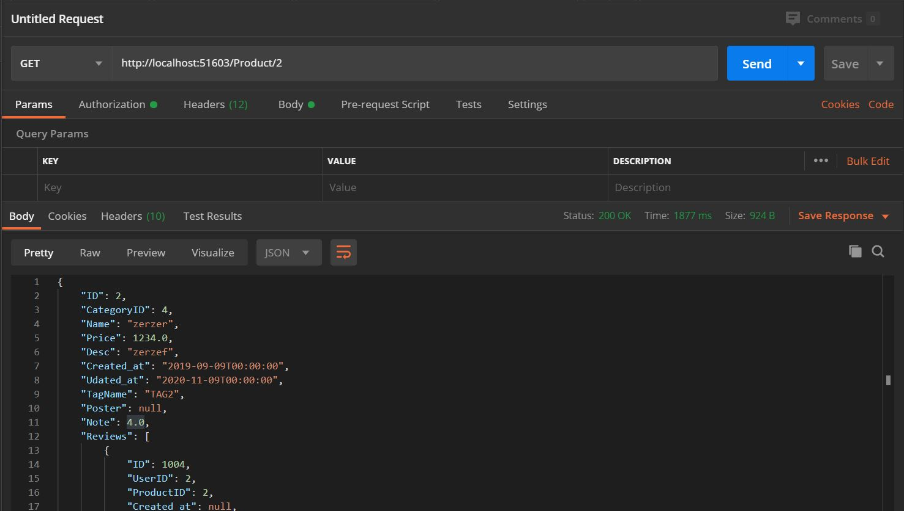
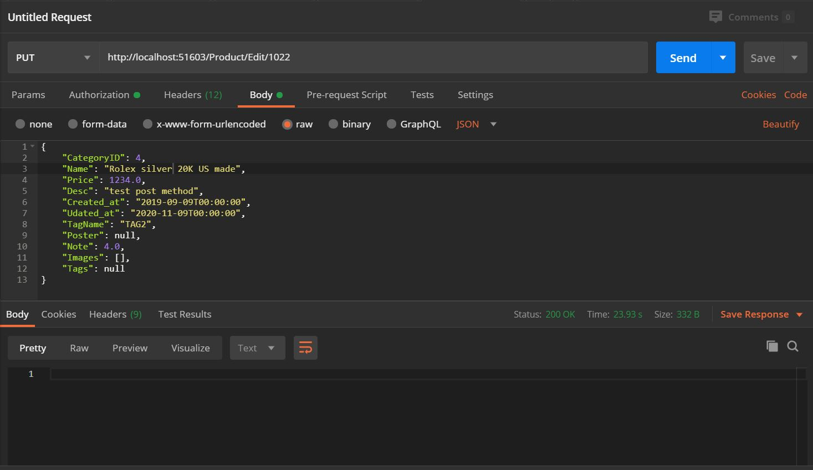
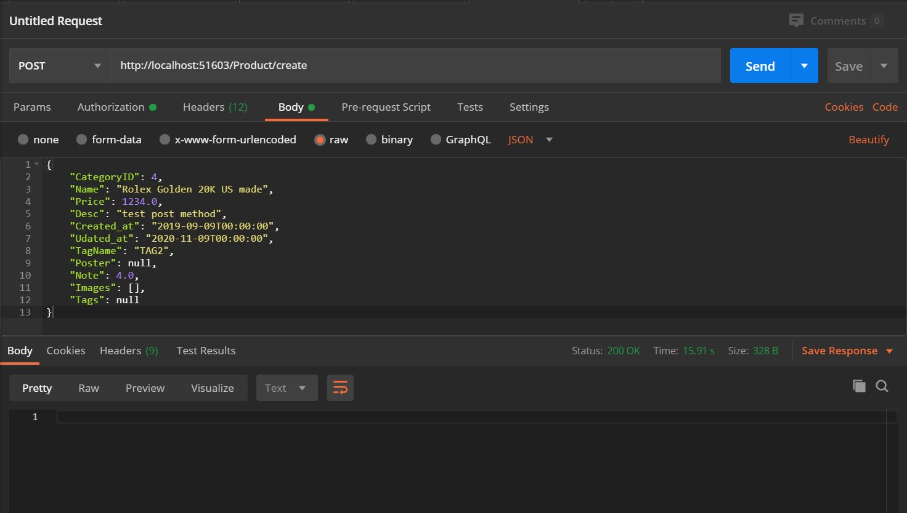
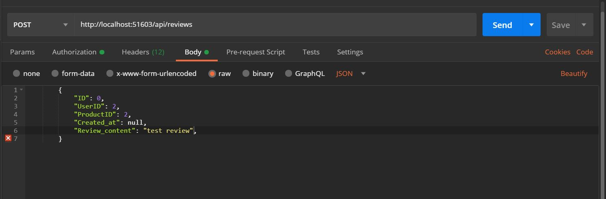

  WORK IN PROGRESS  :construction:  80%

# EcomStore

This project was made with [ASP.NET WEB API]https://docs.microsoft.com/en-us/aspnet/web-api/overview/getting-started-with-aspnet-web-api/tutorial-your-first-web-api)
### What's included:

- ASP.NET 4.7 & C# :heart:
- Identity & EF6 
- High resolution
- Easy to customize :wrench:
- Miscrosoft.Owin.Cors
- Microsoft.AspNet.WebApi.Cors

# Features
- Admin dashboard
-

## Installation

1. Clone This Repo with the following link `https://github.com/ismailraqi/E-commerce-Web-API-`
2. Create a Database in your local machine 
3. Copy the SQL code from WatchStoreDB.sql and execute it
4. Now Click right in your database -> go to properties -> copy the connectionString then go to web.config and replace the DefaultConnection 
5. now go to the WatchStore.Data/App.Config and change the DataSource with your own Server name and copie the connectionString and go back to web.Config and replace it with the StoreEntities 
6. rebuild your solution  
7. It's Done enjoy !

## Preview
#### - To register a new account you should execute this endpoint and pass the values in the request body [POST METHOD]

#### - To login execute this endpoint with values in the request body [POST METHOD]

#### - To retrieve all products from db execute this endpoint [GET METHOD]

#### - To get only one product with details execute this endpoint with id in the param section [GET METHOD]

#### - To Modify product details execute this endpoint with id of product in param section [PUT METHOD]

#### - To Post a new product execute this endpoint with values in body section [POST METHOD]

#### - To Post a new review execute this endpoint with values in body section [POST METHOD]

